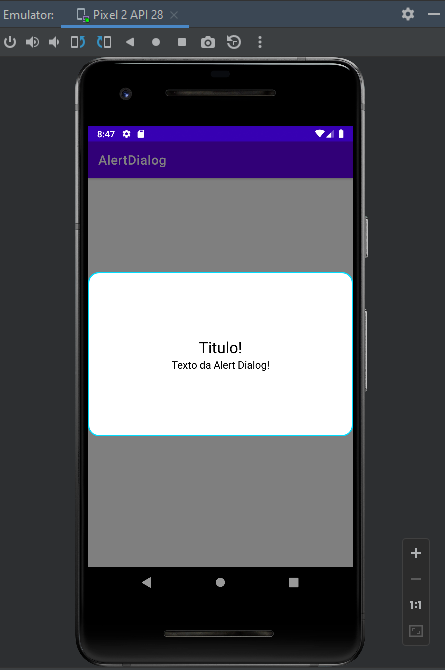

# AlertDialog Customizada (Android Studio)

Descrição:  
Arquivos para usar como base para criar uma AlertDialog personalizada no Android Studio com Kotlin.
 
Arquivos:  
 activity_main.xml = é o front-end da tela principal;  
 MainActivity.kt = é o back-end da tela principal;  
 alert_dialog.xml = é o front-end da alertDialog;  
 style.xml = é onde guardaremos os estilos.
 
 Exibindo alertDialog:  
 

Criado por: Breno Cardoso;  
Github user: BrenoCardoso2002;  
LinkedIn: breno-bernardo-da-silva-cardoso.  
